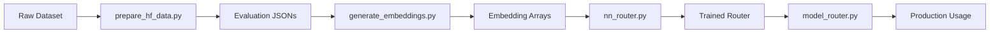

# Auto-Router Training

This directory contains the training pipeline for the neural network-based auto-router. The auto-router learns from historical data to make intelligent routing decisions based on multimodal content (text + images).

## Overview

The auto-router uses a two-stage approach:

1. **Embedding Generation**: Convert text+image inputs into fixed-size vectors using CLIP
2. **Neural Network Training**: Train a classifier to predict which model will perform best

This learned approach complements the intent-based router by optimizing for actual performance on your specific workload.

## Training Pipeline



### Stage 1: Data Preparation

**Script**: `prepare_hf_data.py`

Prepares training data by evaluating multiple models on a dataset:

1. Load a multimodal dataset (text + images)
2. Generate responses from each candidate model
3. Use LLM-as-judge to determine which responses are correct
4. Create labeled data: `{prompt, images, model_scores}`

**Output**: 
- `hf_evaluations_train.json` - Training data with per-model success labels
- `hf_evaluations_test.json` - Test data for evaluation

**Example**:
```json
{
  "idx": 0,
  "prompt": "What is shown in this image?",
  "answer": "A cat sitting on a chair",
  "images": ["<base64_encoded_image>"],
  "model_scores": {
    "gpt-5-chat": 1,
    "nvidia/nemotron-nano-12b-v2-vl": 1,
    "nvidia/nvidia-nemotron-nano-9b-v2": 0
  }
}
```

### Stage 2: Embedding Generation

**Script**: `generate_embeddings.py`

Converts evaluation data into embeddings suitable for neural network training:

1. Connect to CLIP embedding server
2. For each sample, generate:
   - Text embedding (512 dim)
   - Image embedding (512 dim) or zeros if no image
3. Concatenate into combined embedding (1024 dim)
4. Save as NumPy arrays

**Requirements**:
- CLIP server running (see notebooks for setup)
- Evaluation JSON files from Stage 1

**Output**:
- `hf_train_embeddings.npy` - Training embeddings [N, 1024]
- `hf_test_embeddings.npy` - Test embeddings [M, 1024]
- `hf_embeddings_metadata.json` - Metadata about embeddings

**Usage**:
```python
from generate_embeddings import load_embedding_model, generate_embeddings_for_dataset

# Connect to CLIP server
clip_client = load_embedding_model()

# Generate embeddings
embeddings = generate_embeddings_for_dataset(
    clip_client, 
    evaluation_data,
    max_samples=None
)
```

### Stage 3: Neural Network Training

**Script**: `nn_router.py`

Trains a multi-output neural network to predict model success probabilities:

1. Load embeddings and labels
2. Configure neural network architecture
3. Train with class weighting to handle imbalanced data
4. Hyperparameter tuning via random search
5. Evaluate on test set
6. Save trained model

**Architecture**:
```
Input (1024 dim) 
  → Linear + BatchNorm + ReLU + Dropout
  → Linear + BatchNorm + ReLU + Dropout  
  → Linear + BatchNorm + ReLU + Dropout
  → Linear (N models)
  → Sigmoid
Output: [P(model_1_correct), P(model_2_correct), ..., P(model_N_correct)]
```

**Features**:
- Early stopping to prevent overfitting
- Class weighting for imbalanced datasets
- Configurable thresholds for quality gates
- Cost-based selection among qualified models

**Output**:
- `router_artifacts/nn_router.pth` - Trained PyTorch model
- `router_artifacts/model_names.joblib` - Model name mapping
- `router_artifacts/best_hyperparameters.joblib` - Best hyperparameters found

**Configuration**:
```python
# In nn_router.py
default_config = {
    'hidden_dims': [512, 256, 128],
    'dropout': 0.3,
    'learning_rate': 0.001,
    'batch_size': 64,
    'epochs': 50,
    'patience': 10,
}
```

### Stage 4: Production Usage

**Module**: `model_router.py`

Provides a production-ready interface to the trained router:

**Key Classes**:

- **`ModelRouter`**: Main interface for routing
  ```python
  router = ModelRouter(
      router_path="router_artifacts/nn_router.pth",
      model_thresholds={'gpt-5-chat': 0.70},
      device='cuda'
  )
  
  # Route a query
  model = router.route(
      text="Explain quantum computing",
      images=None
  )
  ```

- **`EmbeddingGenerator`**: Handles CLIP embedding generation
- **`RouterNetwork`**: PyTorch neural network model

**Example**: `router_usage_examples.py`
```python
from model_router import ModelRouter

# Initialize router
router = ModelRouter(
    router_path="router_artifacts/nn_router.pth",
    model_thresholds={
        'gpt-5-chat': 0.70,
        'nvidia/nemotron-nano-12b-v2-vl': 0.55,
    },
    verbose=True
)

# Text-only routing
model = router.route("What is the capital of France?")
print(f"Selected: {model}")

# Multimodal routing
model = router.route(
    text="What objects are in this image?",
    images=["data:image/png;base64,iVBORw0KG..."]
)
print(f"Selected: {model}")
```

## Files Reference

### Core Training Scripts

| File | Purpose | Input | Output |
|------|---------|-------|--------|
| `prepare_hf_data.py` | Generate labeled training data | HuggingFace dataset | Evaluation JSONs |
| `generate_embeddings.py` | Convert data to embeddings | Evaluation JSONs | NumPy embedding arrays |
| `nn_router.py` | Train neural network | Embeddings + labels | Trained model (.pth) |

### Production Modules

| File | Purpose |
|------|---------|
| `model_router.py` | Main router interface with CLIP integration |
| `router_usage_examples.py` | Example usage patterns |
| `__init__.py` | Package exports |

### Artifacts Directory

| File | Description |
|------|-------------|
| `nn_router.pth` | Trained PyTorch model (state dict + metadata) |
| `model_names.joblib` | List of model names in training order |
| `best_hyperparameters.joblib` | Optimal hyperparameters from tuning |
| `xgb_multi_router.joblib` | (Optional) XGBoost alternative router |

## Quick Start

### Option 1: Using the Notebooks (Recommended)

The easiest way to train the auto-router is via the included notebooks:

1. **`2_Embedding_NN_Training.ipynb`**: Complete training pipeline
   - Data preparation
   - Embedding generation
   - Neural network training
   - Evaluation and artifact saving

2. **`3_Embedding_NN_Usage.ipynb`**: Using the trained router
   - Loading the router
   - Text and multimodal examples
   - Integration patterns

### Option 2: Running Scripts Directly

```bash
# 1. Prepare evaluation data
python prepare_hf_data.py \
  --dataset "path/to/dataset" \
  --output-dir "." \
  --num-samples 1800

# 2. Generate embeddings
python generate_embeddings.py \
  --train-json "hf_evaluations_train.json" \
  --test-json "hf_evaluations_test.json" \
  --clip-server "0.0.0.0:51000"

# 3. Train neural network
python nn_router.py \
  --train-embeddings "hf_train_embeddings.npy" \
  --test-embeddings "hf_test_embeddings.npy" \
  --train-json "hf_evaluations_train.json" \
  --test-json "hf_evaluations_test.json" \
  --output-dir "router_artifacts"
```

## Requirements

### Python Dependencies

See `requirements.txt`:
- `torch` - Neural network training
- `numpy` - Array operations
- `scikit-learn` - Metrics and utilities
- `clip-client` - CLIP embedding generation
- `datasets` - HuggingFace datasets
- `openai` - API clients for model evaluation
- `tqdm` - Progress bars

### External Services

1. **CLIP Embedding Service** (for embeddings):
  
  ```bash
   # Pull the NIM container
   docker pull nvcr.io/nim/nvidia/nvclip:latest
   
   # Run the NIM service
   docker run -d --rm --runtime=nvidia --gpus all \
     -p 8000:8000 \
     -e NGC_API_KEY=${NGC_API_KEY} \
     nvcr.io/nim/nvidia/nvclip:latest
   ```

2. **Model API Endpoints** (for data preparation):
   - Azure OpenAI or OpenAI API
   - NVIDIA Build API (for Nemotron models)
   - NIM for Nemotron VL (local deployment)

## Configuration

### Model Selection

Define which models to train the router on in your scripts:

```python
MODEL_IDS = {
    "gpt-5-chat": 0,
    "nvidia/nemotron-nano-12b-v2-vl": 1,
    "nvidia/nvidia-nemotron-nano-9b-v2": 2
}
```

### Confidence Thresholds

Set minimum confidence thresholds for routing:

```python
model_thresholds = {
    'gpt-5-chat': 0.70,           # Only route if 70%+ confident
    'nvidia/nemotron-nano-12b-v2-vl': 0.55,
    'nvidia/nvidia-nemotron-nano-9b-v2': 0.50,
}
```

Models not meeting their threshold are skipped in favor of the next best option.

### Cost-Based Selection

Assign cost factors to prefer cheaper models when multiple are qualified:

```python
model_costs = {
    'gpt-5-chat': 1.0,              # Most expensive
    'nvidia/nemotron-nano-12b-v2-vl': 0.3,
    'nvidia/nvidia-nemotron-nano-9b-v2': 0.1,  # Cheapest
}
```

Router will select the lowest-cost model among those meeting their confidence threshold.

## Integration with Router Service

Once trained, integrate the auto-router into the main service:

1. **Place artifacts** in `router_artifacts/`
2. **Update config** (`src/nat_sfc_router/configs/config.yml`):
   ```yaml
   functions:
     nn_objective_fn:
       _type: nn_objective_fn
       model_thresholds:
         'gpt-5-chat': 0.70
         'nvidia/nemotron-nano-12b-v2-vl': 0.55
       model_costs:
         'gpt-5-chat': 1.0
         'nvidia/nemotron-nano-12b-v2-vl': 0.3
     
     sfc_router_fn:
       _type: sfc_router
       objective_fn: nn_objective_fn  # Use auto-router
   ```

3. **Restart service**:
   ```bash
   ./scripts/run_local.sh
   ```

## Performance Tuning

### Hyperparameter Search

`nn_router.py` includes built-in random search:

```python
param_grid = {
    'hidden_dims': [[256, 128], [512, 256], [512, 256, 128]],
    'dropout': [0.2, 0.3, 0.4, 0.5],
    'learning_rate': [0.0001, 0.0005, 0.001],
    'batch_size': [32, 64, 128],
    'weight_decay': [0, 1e-6, 1e-5, 1e-4],
}
```

Set `TUNE_HYPERPARAMETERS = True` to enable.

### Handling Imbalanced Data

Enable class weighting for imbalanced datasets:

```python
USE_CLASS_WEIGHTS = True
```

This ensures the router doesn't just predict the majority class.

### Early Stopping

Configured via patience parameter:

```python
'patience': 10  # Stop if no improvement for 10 epochs
```

## Evaluation Metrics

The router reports several metrics:

- **Per-Model Metrics**:
  - AUC: Area under ROC curve
  - Accuracy: Classification accuracy
  - F1 Score: Harmonic mean of precision/recall
  - Positive Rate: Frequency of success

- **System Metrics**:
  - **Router Accuracy**: How often the selected model succeeds
  - **Oracle Accuracy**: Best possible accuracy (upper bound)
  - **Model Selection Distribution**: How often each model is chosen

**Example Output**:
```
Per-model metrics:
  gpt-5-chat: AUC=0.923, acc=0.847, f1=0.834
  nvidia/nemotron-nano-12b-v2-vl: AUC=0.876, acc=0.812, f1=0.798

Router system accuracy: 0.891
Oracle (best possible): 0.934
```

## Troubleshooting

### CLIP Server Connection Issues

```bash
# Verify CLIP server is running
docker ps | grep clip

# Test connection
python -c "from clip_client import Client; c = Client('grpc://0.0.0.0:51000'); print(c.profile())"
```

### Out of Memory During Training

Reduce batch size:
```python
'batch_size': 32  # or 16
```

Or train on CPU:
```python
router = ModelRouter(device='cpu')
```

### Poor Routing Performance

1. **Collect more training data**: Aim for 1000+ samples
2. **Check data quality**: Ensure LLM judge is accurate
3. **Adjust thresholds**: Lower thresholds = more aggressive routing
4. **Verify embeddings**: Check that images are properly encoded
5. **Try deeper network**: Increase `hidden_dims`

### Embeddings Generation is Slow

- Use GPU for CLIP server
- Process in batches (done automatically)
- Check CLIP server resources

### Custom Datasets

To train on your own data, create evaluation JSONs matching this format:

```json
[
  {
    "idx": 0,
    "prompt": "Your prompt text",
    "answer": "Ground truth answer",
    "images": ["<base64_image1>", "<base64_image2>"],
    "model_scores": {
      "model1": 1,
      "model2": 0,
      "model3": 1
    }
  }
]
```
